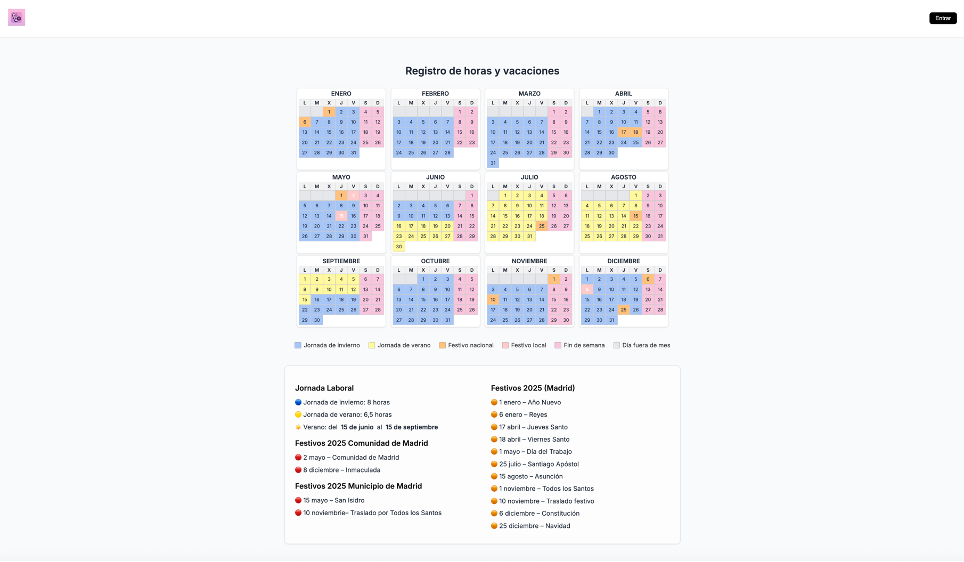

# HORAS 🕒 – Control Horario y Gestión de Vacaciones

**HORAS** es una aplicación web desarrollada para pequeñas empresas que necesitan gestionar de manera digital y centralizada el registro de horas trabajadas y las solicitudes de vacaciones. El sistema permite a los empleados registrar su jornada y solicitar vacaciones, y a los administradores aprobar o rechazar las peticiones, consultar calendarios y generar reportes.



---

## 🚀 Funcionalidades principales

- 📆 Calendario visual de fichajes y vacaciones
- 🔐 Autenticación con roles (empleado/admin)
- ✅ Aprobación y rechazo de solicitudes
- 📊 Exportación de datos a Excel
- 🔄 Visualización simultánea de fichajes y vacaciones
- 🔒 Seguridad: JWT + bcrypt + HTTPS
- 🐳 Dockerizado para despliegue ágil

---

## 🖼️ Capturas de pantalla

### Calendario anual con jornadas laborales y festivos


### Interfaz de usuario – Panel de empleado


### Vista de base de datos en pgAdmin


---

## ⚙️ Tecnologías utilizadas

| Capa       | Tecnología                |
|------------|---------------------------|
| Frontend   | React + Vite              |
| Backend    | Node.js + Express         |
| BBDD       | PostgreSQL                |
| Seguridad  | JWT + bcrypt              |
| Entorno    | Docker + Docker Compose   |
| Herramientas | Postman, PgAdmin, VSCode |

---

## 🧠 Estructura de base de datos

- `usuarios` – Registro de empleados y admins
- `fichajes` – Jornadas laborales
- `vacaciones` – Días solicitados y estado
- `notificaciones` – Mensajes relevantes
- `festivos` – Festivos nacionales y locales
- `config_jornada` – Configuración de jornada por estación

---

## 🐳 Instalación con Docker

```bash
git clone https://github.com/tuusuario/horas.git
cd horas
docker-compose up --build
```

Accede a la aplicación en:

- Frontend: `http://localhost:3000`
- Backend API: `http://localhost:5000`

---

## 🧪 Pruebas y validación

- Pruebas unitarias (Jest)
- Pruebas de endpoints con Postman
- Verificación de roles y permisos
- Validación manual en entorno de producción

---

## 📘 Documentación completa

Disponible en la carpeta `/docs` del proyecto, incluyendo:

- Casos de uso (empleado vs admin)
- Diagrama entidad-relación (E/R)
- Arquitectura cliente-servidor
- Planificación temporal
- Conclusiones y mejoras propuestas

---

## 🧩 Mejores futuras

- App móvil nativa
- Alertas automáticas por email
- Integración con sistemas biométricos o NFC
- Exportación avanzada a PDF y gráficos

---

## 👤 Autor Valentina Florina Marta

Proyecto desarrollado como aplicación final de ciclo formativo.  
Más información en la memoria técnica.

